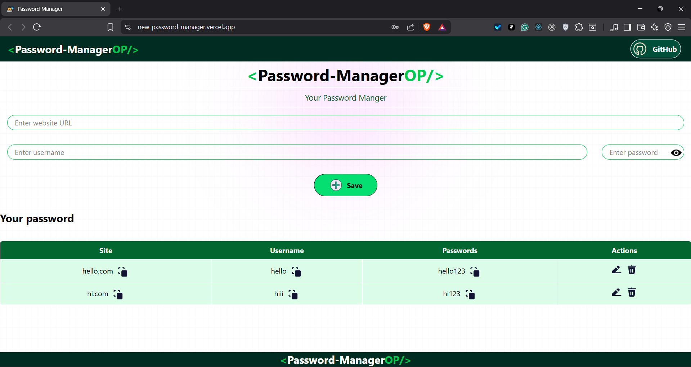
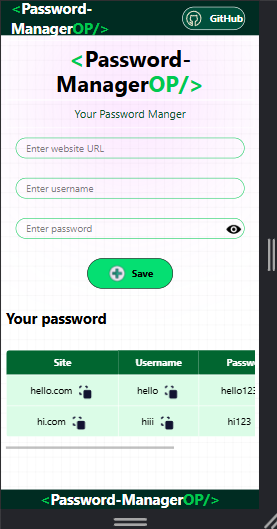
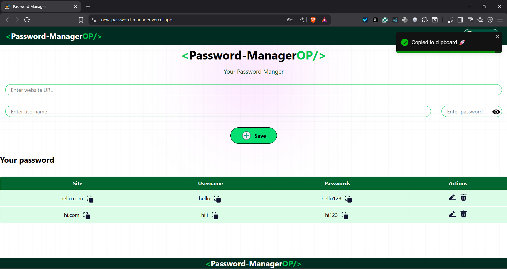
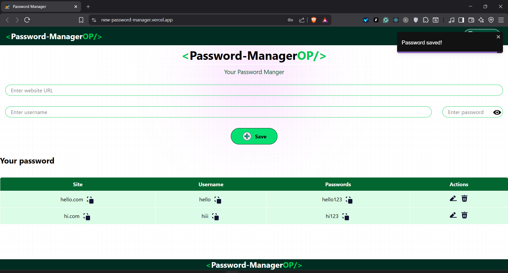
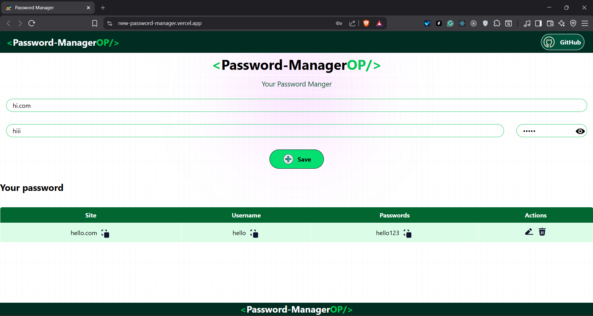

# 🔐 Password Manager App

A modern, responsive **Password Manager Web Application** built using **React, Vite, Tailwind CSS, and Toastify**.  
Users can securely store, view, copy, edit, and delete their passwords with a clean UI and smooth UX.

🚀 Live Demo:  
👉 https://new-password-manager.vercel.app/

---

## ✨ Features

✅ Add website, username, and password  
✅ Show / Hide password toggle  
✅ Copy to clipboard with toast notification  
✅ Edit saved passwords  
✅ Delete passwords with confirmation  
✅ LocalStorage persistence  
✅ Fully responsive (Mobile + Desktop)  
✅ Clean UI using Tailwind CSS  
✅ Animated icons using LordIcon  

---

## 🖥️ Tech Stack

- Frontend: React (Vite)  
- Styling: Tailwind CSS  
- Notifications: React Toastify  
- Icons: LordIcon  
- State Management: React Hooks  
- Storage: Browser LocalStorage  
- Deployment: Vercel  

---

## 📸 Screenshots

### 📊 Dashboard View

### 📱 Mobile View

### 📋 Copy to Clipboard Toast

### ✅ Password Saved Notification

### 👁️ Password Toggle ON

### 🙈 Password Toggle OFF

---

## ⚙️ Installation & Setup

Clone the repository:

git clone https://github.com/AdityaLad1/new-password-manager.git  
cd new-password-manager  

Install dependencies:

npm install  

Run locally:

npm run dev  

Open in browser:

http://localhost:5173  

---

## 📦 Build for Production

npm run build  

Preview build:

npm run preview  

---

## 📌 Future Enhancements

- MongoDB backend integration  
- User authentication  
- Cloud sync  
- Encryption for stored passwords  
- Export / Import passwords  

---

## 👨‍💻 Author

Aditya Lad  
Frontend Developer | React | Tailwind | MERN  

GitHub: https://github.com/AdityaLad1  

---

🔥 This project demonstrates real-world React concepts, clean UI practices, responsive design, and production deployment.
